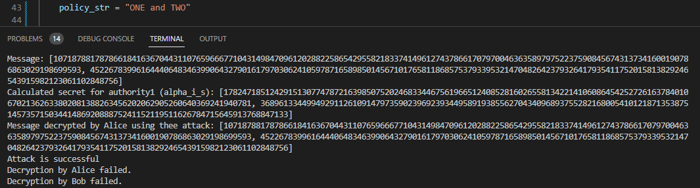

# Attacking DAC-MACS

## Introduction

## Definitions

### Security

### Privacy

## Analysis

### Theory

We analyzed the attribute-based encryption scheme proposed in the paper:

> Yang, K., Jia, X., Yang, K., & Jia, X. (2014). DAC-MACS: Effective data access control for multi-authority cloud storage systems. _Security for Cloud Storage Systems_, 59-83.

Our attack is based on the work by

> Venema, M., & Alpár, G. (2021, May). A bunch of broken schemes: A simple yet powerful linear approach to analyzing security of attribute-based encryption. In _Topics in Cryptology–CT-RSA 2021: Cryptographers’ Track at the RSA Conference 2021, Virtual Event, May 17–20, 2021, Proceedings_ (pp. 100-125). Cham: Springer International Publishing.

specifically secions **3** and **5.1**.

We summarize their findings by focusing on the details that are most relevant to understanding and implementing the attack. The scheme contains several parameters that are not relevant to the discussed attack; we list only those that are directly used below:

- Global parameters:
	- $g$ (generator)
	- $g^b$ ($b$ random)
- Authority public key: $e(g,g)^{\alpha_i}$
- User keys:
	- $x_1$
	- $g^{x_2}$
	- $g^{\alpha_i/x_1 + x_2b + r_ib/b_i}$
	- $g^{r_ib}$
	- User receives a certificate that additionally includes $x_2$. Knowing this value enables the attack.
- Ciphertext (for a single authority) contains these values (where $m$ is the message, $s$ is a random value):
	- $g^s$
	- $g^{\frac{s}{b_i}}$
	- $m\cdot e(g,g)^{\alpha_i s}$

From these values, we can calculate the following:

$$
\frac{e(g^{\alpha_i/x_1 + x_2b + r_ib/b_i}, g^{s})^{x_1}}{e(g^b, g^s)^{x_1x_2} e(g^{r_ib}, g^{s/b_i})^{x_1}} = 
\frac{e(g, g)^{(\alpha_i/x_1 + x_2b + r_ib/b_i) \cdot s \cdot x_1}}{e(g, g)^{bsx_1x_2} e(g, g)^{r_ibx_1s/b_i}} =
\frac{e(g, g)^{\alpha_is + sx_1x_2b + sx_1r_ib/b_i}}{e(g, g)^{bsx_1x_2 + r_ibx_1s/b_i}} =
e(g,g)^{\alpha_is}
$$

Because the message is blinded by this value in the ciphertext we can retrieve it with a simple division:
$$\frac{m\cdot e(g,g)^{\alpha_i s}}{e(g,g)^{\alpha_i s}}=m$$
### Practice
Below we show the implementation of this attack.

We demonstrate the implementation of this attack using the Python Charm crypto framework ([https://jhuisi.github.io/charm/index.html](https://jhuisi.github.io/charm/index.html)) and its implementation of the *DAC-MACS* scheme. ([https://github.com/JHUISI/charm/blob/dev/charm/schemes/abenc/abenc_dacmacs_yj14.py](https://github.com/JHUISI/charm/blob/dev/charm/schemes/abenc/abenc_dacmacs_yj14.py))

This contains a class 
```python
class DACMACS(object):
    ...
```
which implements the discussed scheme.

Our code can be broken down into 6 sections.

#### 1. Global setup

We use group *SS512* for our implementation but any other choice would make no difference.
Firstly we run the usual setup steps declaring and initializing the necessary variables for the global parameters.

```python
    groupObj = PairingGroup("SS512")
    dac = DACMACS(groupObj)
    global_public_parameters, _ = dac.setup()

    users = {}
    authorities = {}
```

#### 2. Authority setup

We setup one central authority (*authority1*) with two possible attributes (*ONE* and *TWO*).

```python
    authority1 = "authority1"
    possible_attributes = ["ONE", "TWO"]

    dac.setupAuthority(global_public_parameters, authority1, possible_attributes, authorities)
```

#### 3. User registrations

We register two users:
- Alice with attribute *ONE* and
- Bob with attribute *TWO*.

```python
    alice = {"id": "alice", "authoritySecretKeys": {}, "keys": None}

    alice["keys"], users[alice["id"]] = dac.registerUser(global_public_parameters)

    alice_attr_keys = dac.keygen(global_public_parameters, authorities[authority1],
                                 "ONE", users[alice["id"]], alice["authoritySecretKeys"])


    bob = {"id": "bob", "authoritySecretKeys": {}, "keys": None}

    bob["keys"], users[bob["id"]] = dac.registerUser(global_public_parameters)

    bob_attr_keys = dac.keygen(global_public_parameters, authorities[authority1],
                               "TWO", users[bob["id"]], bob["authoritySecretKeys"])
```

#### 4. Message encryption

We choose a random message (a random element of the group).
Different policies can be set, but as we will see the attack does not depend on this value.

The possibilities are:

- ONE: Alice can decrypt, Bob cannot
- TWO: Bob can decrypt, Alice cannot
- ONE or TWO: Both should be able to decrypt
- ONE and TWO: Neither should be able to decrypt

```python
    message = groupObj.random(GT)

    policy_str = "ONE and TWO"

    ciphertext = dac.encrypt(global_public_parameters, policy_str, message, authorities[authority1])
```

#### 5. Performing the attack

We collect the values and rename them to mirror *Section 5.1* from the cited paper. We retrieve the secret key of the authority that is used to blind messages only using values known to Alice.

It sould be noted that making `x_2` unknowable to Alice (possibly by encrypting it) would prevent this attack.

```python
    x_2 = users[alice["id"]]["u"]  # This shouldn't be known to Alice
    x_1 = alice["keys"][1]
    k_1 = alice_attr_keys["K"]
    k_3 = alice_attr_keys["R"]
    c2 = ciphertext["C2"]
    c3 = ciphertext["C3"]

    temp1 = pair(k_1, c2) ** x_1
    temp2 = pair(global_public_parameters["g_a"], c2) ** (x_1 * x_2) * pair(k_3, c3) ** x_1

    a_i_s = temp1 / temp2

    decrypted = ciphertext["C1"] / a_i_s
```

If we compare the value of `decrypted` we will see that it is identical to `message`.

#### 6. Showing an honest decryption

Finally, we demonstrate how an honest decryption by Bob, who follows the rules of the scheme would work.

```python
    try:
        token = dac.generateTK(global_public_parameters, ciphertext,
                               bob["authoritySecretKeys"], bob["keys"][0])
        assert token
        plaintext = dac.decrypt(ciphertext, token, bob["keys"][1])
        print(f"Message decrypted by Bob: {plaintext}")

    except AssertionError:
        print("Decryption by Bob failed.")
```

### Example runs

The following pictures are screenshots showing the results of running the program with different policies set for the encrypted message.


---


---


---



In each picture, we can see that the attack is successful, and the generated message is equal to the one acquired by running the attack.

## Conclusion